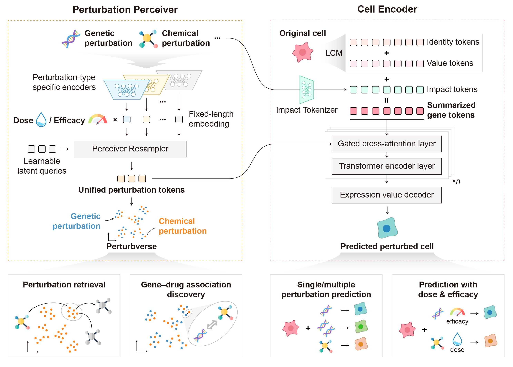

# 🌌 X-Pert: Unified In Silico Perturbation Modeling

[](https://www.python.org/downloads/)
[](LICENSE)
[](https://github.com/psf/black)
[](https://github.com/bowang-lab/scGPT)
[](#)

X-Pert is a transformer-based framework that jointly models cellular responses to genetic, chemical, and combinatorial perturbations. The system couples a **Perturbation Perceiver** that embeds heterogeneous perturbations into a shared latent "Perturbverse" with a **Cell Encoder** that fuses gene identity, expression, and perturbation impact tokens. This architecture captures hierarchical gene–perturbation and gene–gene dependencies, enabling accurate prediction of unseen, combinatorial, and dose/efficacy-dependent perturbations while supporting downstream tasks such as perturbation retrieval and drug–gene association discovery.



## 🗞️ News

- **2025-11-12** — X-Pert officially goes open source on GitHub, sharing the full in silico perturbation workflow with the community.


## 🚀 Key Capabilities

- **Unified Perturbation Space**: Learn latent representations that align genetic and chemical perturbations for cross-type analysis and retrieval.
- **Hierarchical Response Modeling**: Couple cross-attention and gated self-attention to preserve perturbation-specific regulatory cascades and pathway programs.
- **Dose & Efficacy Awareness**: Integrate quantitative perturbation strength to improve predictions under variable dosage and sgRNA efficacy.
- **Scalable Benchmarks**: Demonstrate superior performance across single-cell and bulk datasets, including unseen perturbations, combinations, and large-scale screens.
- **Downstream Discovery**: Support perturbation retrieval, drug repurposing, and biologically interpretable embedding analyses via the Perturbverse.

## 🧩 Installation

> ❗ **Prerequisite**: Install [scGPT](https://github.com/bowang-lab/scGPT) before setting up X-Pert, as X-Pert relies on the single-cell foundation model provided by scGPT.

```bash
pip install scgpt
```

### Install from source

```bash
git clone https://github.com/Chen-Li-17/X-Pert.git
cd X-Pert
pip install -e .
```

### Reproduce the documented environment

```bash
conda env create -f environment.yml
conda activate xpert
```

## 📚 Tutorials

Leverage the Jupyter notebooks under `examples/` to reproduce the workflows presented in the manuscript.

- **Create perturbation datasets**
  - `examples/create_perturbation_data/1_genetic_perturbation_data.ipynb`
  - `examples/create_perturbation_data/2_chemical_perturbation_data.ipynb`
  - `examples/create_perturbation_data/3_cotrain_perturbation_data.ipynb`
- **Train X-Pert on genetic perturbations**
  - `examples/genetic_perturbation/1_X-Pert_genetic_perturbation.ipynb`
- **Train X-Pert on chemical perturbations**
  - `examples/chemical_perturbation/1_X-Pert_chemical_perturbation.ipynb`
- **Visualize the Perturbverse**
  - `examples/perturbverse_visualization/plot_perturbverse.ipynb`

## ⚙️ Quick Start (Placeholder)

Code APIs are under active development. Refer to the notebooks above for complete, reproducible workflows. The Python package will expose high-level APIs for perturbation representation and response prediction in future releases.

## 📖 Documentation

Detailed documentation, benchmarks, and supplementary materials will be published at [https://x-pert.readthedocs.io](https://x-pert.readthedocs.io).

## 📄 License

This project is licensed under the MIT License. See the [LICENSE](LICENSE) file for details.

## 💌 Contact

- Project Homepage: https://github.com/Chen-Li-17/X-Pert
- Issue Tracker: https://github.com/Chen-Li-17/X-Pert/issues
- Correspondence: chen-li21@mails.tsinghua.edu.cn
